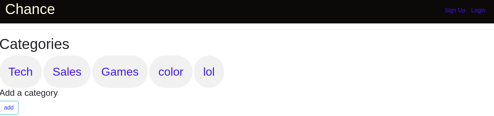

# Chance

#### App that allows on to post and views pitches , {July 3 2020}

#### By Tellvinch imani

## Description

This is an application that allows a user to create a pitch category if it doesnt exist and add pitch content. A user can also be able to comment  on another users pitch.

#### Screenshot

## Setup/Installation Requirements

Clone this repository and navigate to the folder. Run the following commands to allow functionality of the app:-
* sudo add-apt-repository ppa:jonathonf/python-3.6
* sudo apt-get update
* sudo apt-get install python3.6
* sudo apt-get install python3-pip
* sudo apt-get install python3.6-venv
* python3.6 -m venv virtual
* source virtual/bin/activate
* pip install -r requirements.txt
* chmod a+x start.sh
* ./start.sh

## Dependencies

alembic==0.9.9
blinker==1.4
click==6.7
dominate==2.3.1
Flask==1.0.2
Flask-Bootstrap==3.3.7.1
Flask-Login==0.4.1
Flask-Mail==0.9.1
Flask-Migrate==2.2.1
Flask-Script==2.0.6
Flask-SQLAlchemy==2.3.2
Flask-Uploads==0.2.1
Flask-WTF==0.14.2
itsdangerous==0.24
Jinja2==2.10
Mako==1.0.7
MarkupSafe==1.0
psycopg2==2.7.5
psycopg2-binary==2.7.5
python-dateutil==2.7.3
python-editor==1.0.3
six==1.11.0
SQLAlchemy==1.2.8
visitor==0.1.3
Werkzeug==0.14.1
WTForms==2.2.1
## Known Bugs
none so far
## Technologies Used

* Python 3.6
* HTML
* Markdown

## Support and contact details
feel free to send me feedback through email or bugs  at tellvinchimani@gmail.com
### [MIT LICENSE](https://github.com/Tellvinch/chance01/blob/master/License.md)